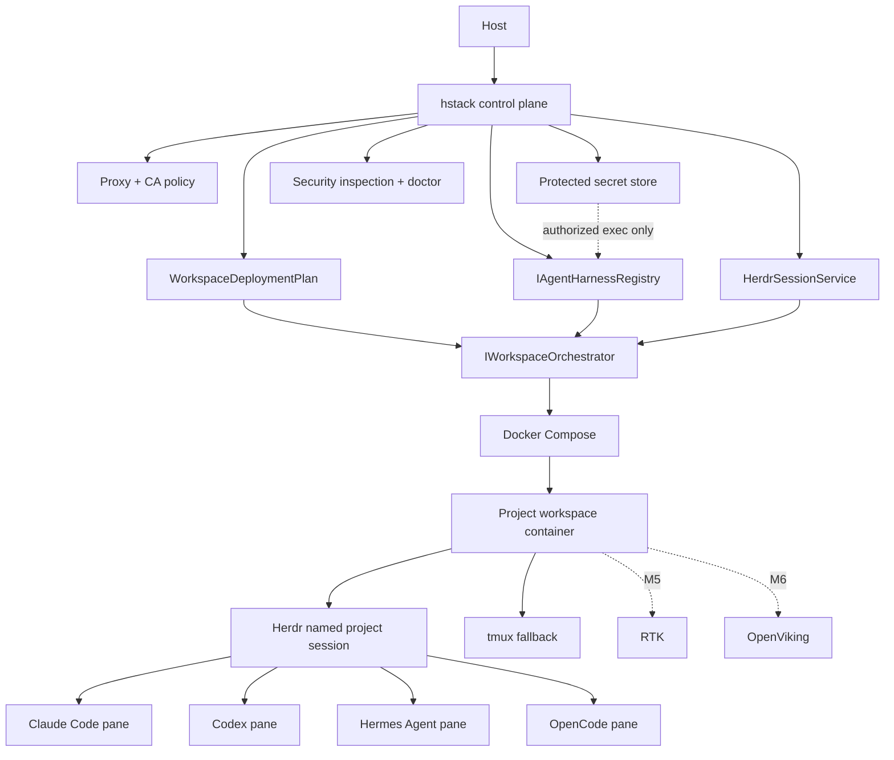

# HermesStack architecture

HermesStack is a local secure control plane. It owns orchestration, policy, lifecycle and diagnostics; specialized upstream tools retain ownership of agent behavior, authentication, session protocols, context and token filtering.

## Deployment source of truth

Configuration is validated before a `WorkspaceDeploymentPlan` is built. Compose only renders and executes that validated plan. M4 adds normalized proxy variables to the plan but deliberately keeps secret values out of it.

## Agent boundary

Each direct agent integration remains an `IAgentHarness`. Direct `hstack claude|codex|hermes|opencode` remains the fallback path alongside Herdr-managed sessions.

M4's `SecretInjectionService` resolves values only for the selected project and agent. The Docker orchestrator passes only secret names as `docker compose exec -e NAME` arguments while the actual values live in the Docker CLI process environment. This avoids both Compose persistence and command-line value exposure.

## Session boundary

Each project receives the Herdr session name `hstack-<project-id>` and logical workspace label `hstack:<project-id>`. Herdr state lives under that project's mounted HOME. tmux remains a fallback and HermesStack does not nest Herdr inside tmux.

## Inspection boundary

`WorkspaceDeploymentPlan` remains the declared policy authority. `DockerWorkspaceSecurityInspector` reads effective container state when available. `SecurityInspectionService` applies deterministic scoring, and `doctor` combines host, network, certificate, agent/session and security diagnostics.
