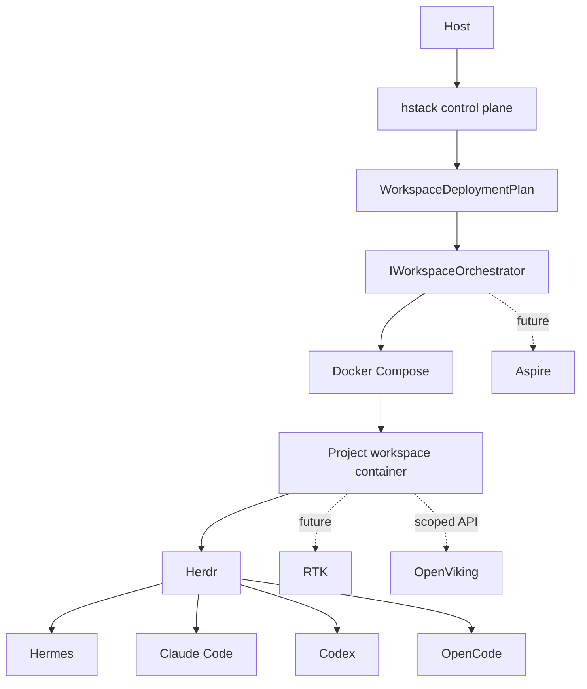

# HermesStack architecture

HermesStack is a local secure control plane. It owns orchestration, policy, lifecycle and diagnostics; specialized upstream tools retain ownership of sessions, agent behavior, context and token filtering.

## M1 source of truth

Configuration is validated before a `WorkspaceDeploymentPlan` is built. The Compose backend only renders and executes the validated plan. Security rules therefore do not belong to Compose-specific code.
