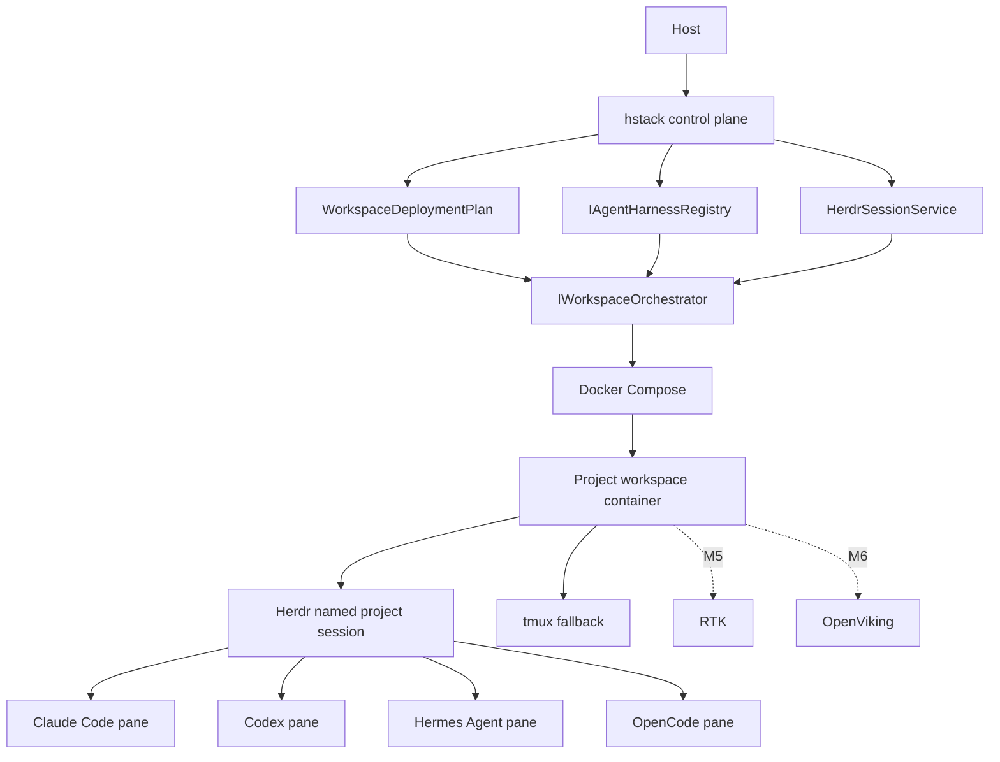

# HermesStack architecture

HermesStack is a local secure control plane. It owns orchestration, policy, lifecycle and diagnostics; specialized upstream tools retain ownership of agent behavior, authentication, session protocols, context and token filtering.

## Deployment source of truth

Configuration is validated before a `WorkspaceDeploymentPlan` is built. Compose only renders and executes that validated plan. M3 adds a structured detached execution flag so the Herdr headless server can run as a workspace process; it does not add shell command interpolation or Docker daemon access.

## Agent boundary

Each direct agent integration remains an `IAgentHarness`. M3 does not replace those M2 adapters: it composes them with Herdr. Direct `hstack claude|codex|hermes|opencode` remains the fallback path.

## Session boundary

Each project receives the Herdr session name `hstack-<project-id>` and the logical Herdr workspace label `hstack:<project-id>`. Herdr state lives under that project's mounted HOME. HermesStack installs Herdr's bundled official integrations for the four managed agents and uses Herdr's JSON control commands to create topology and launch named agents.

Herdr is the logical session owner because current Herdr has its own persistent background server, pane model and native agent-session restoration. tmux remains installed and exposed through `hstack tmux` as a fallback; HermesStack deliberately does not nest Herdr inside tmux.
