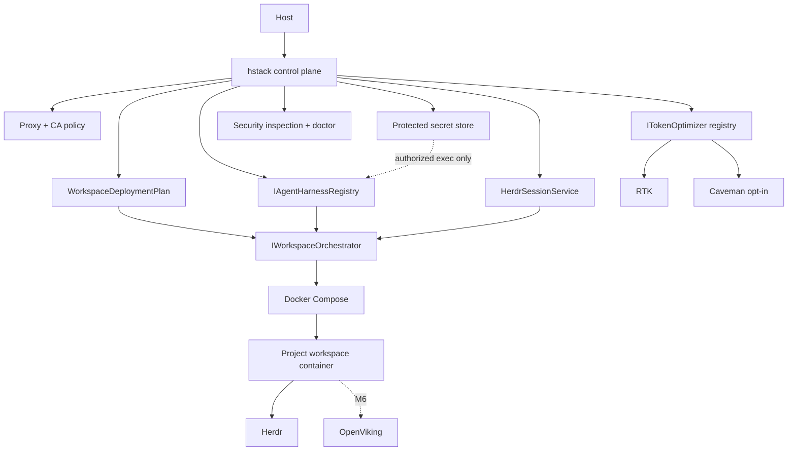

# HermesStack architecture

HermesStack is a local secure control plane. It owns orchestration, policy, lifecycle and diagnostics; specialized upstream tools retain ownership of agent behavior, authentication, sessions, token filtering and context.

## Deployment source of truth

Configuration is validated before a `WorkspaceDeploymentPlan` is built. Compose only renders and executes that plan. Secret values stay out of the plan.

## Token optimization boundary

`ITokenOptimizer` owns lifecycle integration, not compression algorithms. M5 provides a static registry, project policy store, compatibility policy, health checks and evidence-qualified metrics.

RTK owns shell command rewriting/filtering. Caveman owns its agent-native semantic compression. HermesStack invokes their official integration paths and can remove/disable them.

The default balanced profile uses RTK only. Caveman is never automatically stacked. A PotentiallyLossy combination requires explicit user consent.

## Metrics boundary

RTK's raw tracking database is redirected to the workspace tmpfs and recall is disabled. HermesStack stores only sanitized aggregate metric records. RTK's bytes-to-token conversion is labeled Estimated.

## Session and agent boundary

Agent homes and Herdr state remain project-scoped. RTK and Caveman integrations are written into those same isolated homes, so enabling optimization for one project does not modify another project's agent state.

## M8 Aspire deployment (integrated, not release validated)

M8 introduces an Aspire-backed workspace orchestration path alongside the existing Compose path. HermesStack owns the validated deployment document, policy and security invariants; the Aspire AppHost consumes that document and starts the workspace container. Aspire's automatic HTTPS certificate injection conflicts with read-only container roots, so HStack manages its own CA trust and must explicitly disable the Aspire certificate injection in both the checked-in and generated AppHost projects. The generated project remains an open runtime-validation issue. See `docs/release-readiness.md`.
