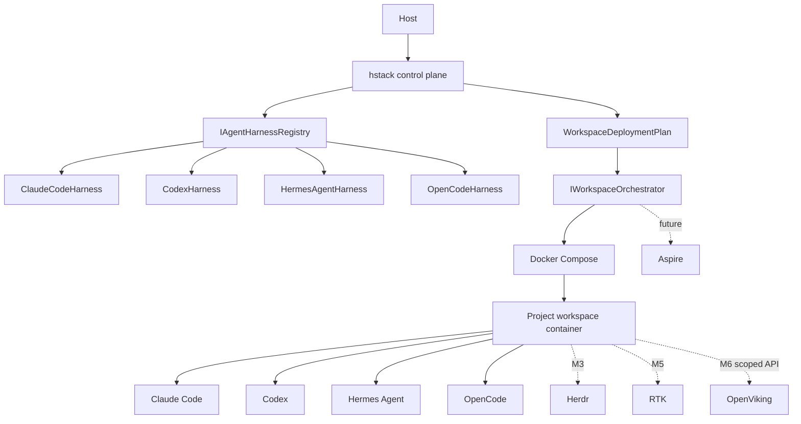

# HermesStack architecture

HermesStack is a local secure control plane. It owns orchestration, policy, lifecycle and diagnostics; specialized upstream tools retain ownership of agent behavior, authentication flows, sessions, context and token filtering.

## Deployment source of truth

Configuration is validated before a `WorkspaceDeploymentPlan` is built. Compose only renders and executes that validated plan. Security rules therefore do not belong to Compose-specific code.

## M2 agent boundary

Each agent integration is an `IAgentHarness` registered in `IAgentHarnessRegistry`. The CLI resolves a harness by id and uses the same launch pipeline for both canonical and ergonomic commands. There is no central agent switch statement.

The harness owns only HermesStack-facing adaptation: executable name, version inspection, upstream authentication entry point and small project-scoped defaults. The upstream agent remains responsible for its own interactive UI, authentication protocol and model behavior.

Agent state is mounted separately beneath `~/.hstack/data/projects/<project>/`. Host user agent state is never implicitly reused.

For Hermes Agent, `TERMINAL_ENV=local` is set by the deployment plan because the workspace container itself is already the sandbox; Hermes must not attempt to reach the host Docker daemon.
